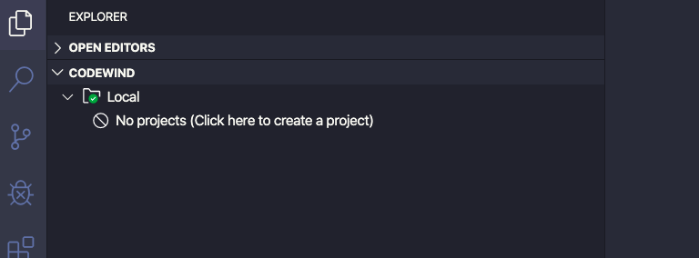

# Installing Codewind for VS Code

Codewind for VS Code enables you to develop your containerized projects from within VS Code.

 

To install Codewind for VS Code, complete the following steps:

1. Install [VS Code version 1.38 or later](https://code.visualstudio.com/download).
2. Install [Docker](https://docs.docker.com/install/) 17.06 or later. If you use Linux, you also need to install Docker Compose.
3. Install Codewind by clicking [this link](vscode:extension/IBM.codewind) to install from the [VS Code Marketplace](https://marketplace.visualstudio.com/items?itemName=IBM.codewind), or by searching for *Codewind* in the [VS Code Extensions view](https://code.visualstudio.com/docs/editor/extension-gallery#_browse-for-extensions).
    - If you're going to work on Java projects, also install the [Java Extension Pack](https://marketplace.visualstudio.com/items?itemName=vscjava.vscode-java-pack).
4. Open the Codewind view in the [Explorer view group](https://code.visualstudio.com/docs/getstarted/userinterface), or enter *Focus on Codewind View* into the [Command Palette](https://code.visualstudio.com/docs/getstarted/userinterface#_command-palette).
    - If you do not see the Codewind view in either the Explorer or the Command Palette, the extension did not install correctly.
5. Codewind requires the installation of additional Docker images to run.  Choose **Install** when prompted to complete the installation.  The installation may take a few minutes to complete.
6. Once complete, you will now have a CODEWIND section in the IDE
   

Next step, 
<a class="cw-gettingstarted-card-link" href="vsc-firstproject.md">Create your first project</a>

