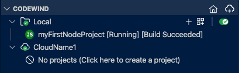
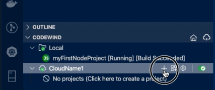

## Connecting VSCode to Remote Codewind

Locate the Codewind view in VSCode and click the cloud icon to launch the new connection wizard:

Add a connection name and press enter

Complete the 3 required fields and save : Gatekeeper URL,  developer username, develper password:

 

The IDE will then validate the connection and add it to the Codewind panel :

 

At this the IDE and Codewind are connected

## Adding a deployment registry

Before projects can be deployed on Kubernetes you need to specify a docker registry. In this example we will use DockerHub.  If its not already open navigate to the connection details page via the link :

Locate and click 'Open Container Registry Manager':

Once the image registry screen opens click '+ Add New'

Then complete the docker connection details for example if you are using Docker hub enter docker.io and press enter

Then enter

1. your dockerhub username
2. your dockerhub password
3. your repo name which is usually the same as your username

The connection will be tested to validate your credentials and stored in a Kubernetes secret within the Codewind service.

## Create a new project

Navigate to the Codewind panel and click the + icon beside the new cloud deployment :

Select the template type, project name and your new project should be built and after a few seconds begin running in the cloud.

