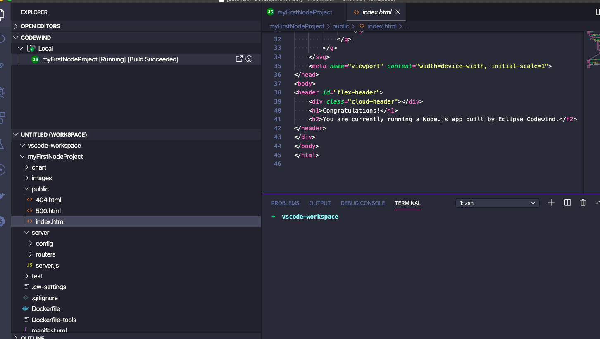
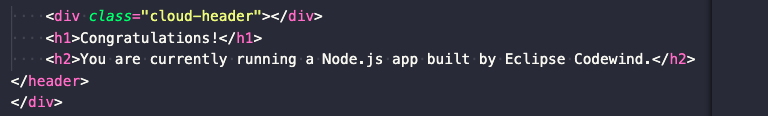
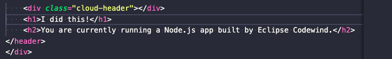
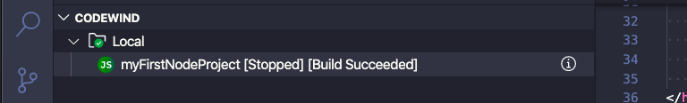

# Making a code change

Codewind will automatically build and redeploy your application whenever you make a code change and save the file.

To see this in action, we can make a change to the getting started example.

First step is to edit the index.html file

and navigate to the bottom of the file to find the lines

Change the heading from *Congratulations* to be *I did this* 

You will see the status of the project change to be *stopped* whilst the project is being rebuilt and deployed

After a few moments, the status will change back to running

Clicking the

icon will now show your code change running

Next step, 
<a class="cw-gettingstarted-card-link" href="remote-overview.md">Buiding and deploying in a cloud environment</a>