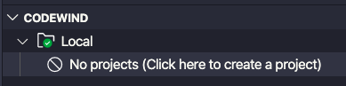
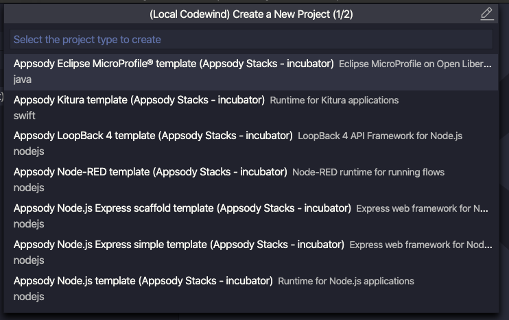

# Creating your first project

To create your first project, click on the prompt in the CODEWIND extension

This will promopt you with a list of project types to select from.

Scroll through the list until you see Node.js Express (Default templates)

Selecting this template will prompt you to enter a name for your project

Enter a name and the choose where to create this on disk

Codewind will now start to build and run your very first project.  On completion, you will be presented with the following screen showing your application is built and running.

To view your running application, click on the project name in the CODEWIND window 

and select the icon

This will launch your web browser and display your application

Congratulations, you have just created your first application on Codewind

Next step, 
<a class="cw-gettingstarted-card-link" href="vsc-codechange.md">Making a code change</a>

